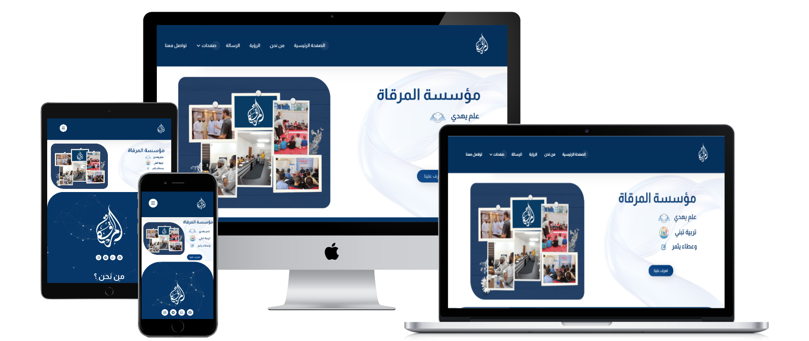
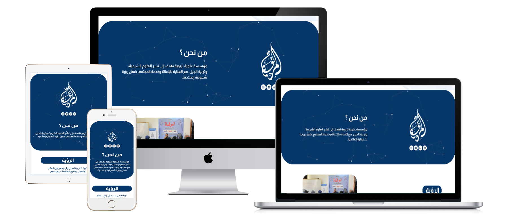
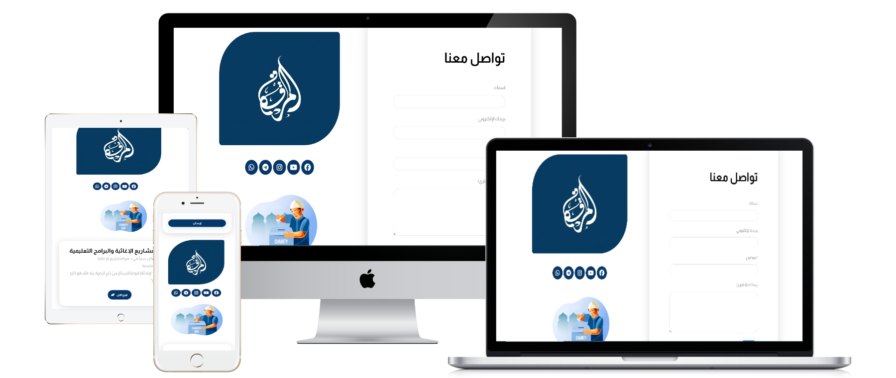
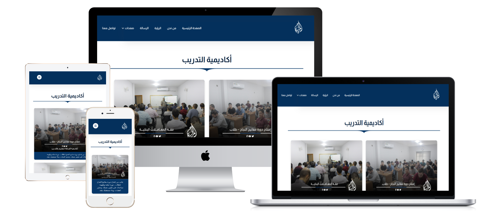

# Academic-Charity-Platform-Al-Marqa-Foundation
Al-Marqat Foundation is an educational and scientific institution dedicated to spreading Islamic sciences and educating the next generation, within a reformist vision and serving the community.

## pictures

## 📝 الوصف القصير للمشروع
- العميل: مؤسسة المرقاة – مؤسسة تربوية علمية تعنى بنشر العلوم الشرعية وتربية الجيل، ضمن رؤية إصلاحية وخدمة المجتمع.
- نوع الموقع: موقع مؤسسي تعريفي يُبرز البرامج الأكاديمية، الإغاثية، والتربوية، إلى جانب الإنجازات والمبادرات الاجتماعية.
- الهدف من التصميم: بناء واجهة تعكس هوية المؤسسة الأكاديمية والخيرية، مع تسهيل التصفح وزيادة التفاعل والدعم.
- التقنيات المستخدمة: WordPress (أو Hostinger Website Builder) | HTML | CSS | JavaScript | تصميم متجاوب.

## 💡 المميزات والتفاصيل الإضافية
- عرض واضح للأقسام والبرامج التعليمية والخيرية.
- قسم إنجازات بصري وفعّال.
- معرض صور ومرئيات يوثق نشاطات المؤسسة.
- عرض أنشطة خيرية مثل كفالة الأيتام ودعم المشاريع.

## 🔗 رابط الموقع: https://almarqa.org/
